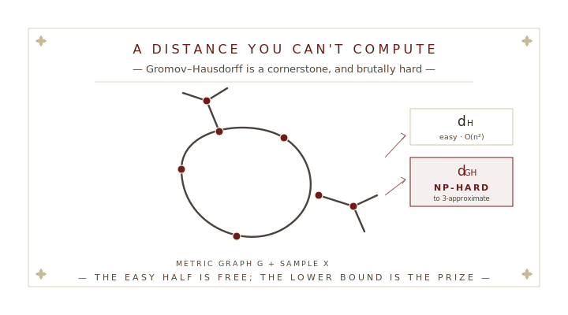
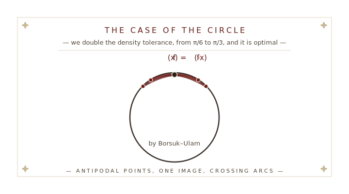
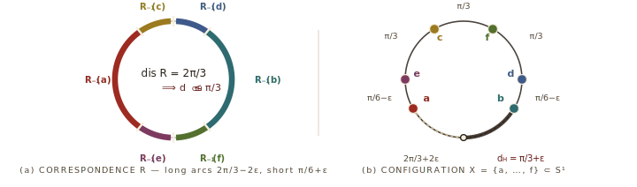
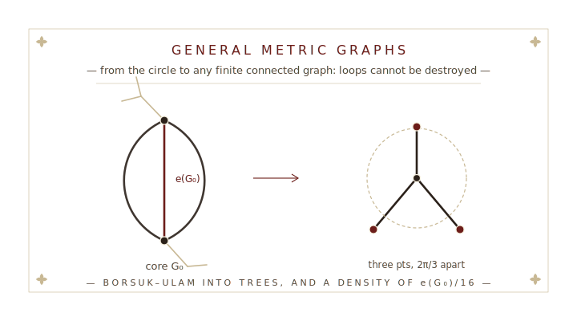
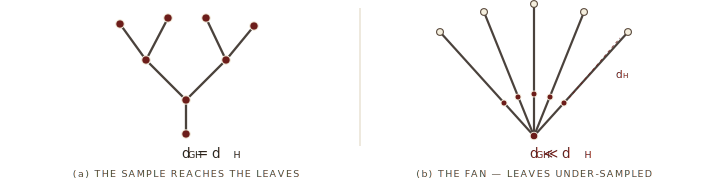

# § I.  A Distance You Can't Compute {.section-divider}

::: {.plate}

:::

::: {.notes}
Section I — the problem.

The Gromov–Hausdorff distance measures how far two metric spaces are from being isometric. It is a cornerstone dissimilarity in topological data analysis — for comparing shapes and datasets. But it is brutal to compute: even *approximating* it within a factor of three is NP-hard for trees with unit edges (Agarwal–Fox–Nath–Sidiropoulos–Wang).

The applied move is to replace infinite objects by finite samples and measure density with the Hausdorff distance. For a sample inside the space, one inequality is free. The hard, valuable half is the lower bound. Get it, and the uncomputable quantity collapses to the easy one.
:::


## The cornerstone

::: {.standfirst style="font-size: 0.95em; margin: -0.3rem 0 0.3rem;"}
$d_{\mathrm{H}}$ needs the sets to live in *one* space; $d_{\mathrm{GH}}$ compares them *up to isometry* — no ambient space required.
:::

::: {.def-box .fragment data-title="Hausdorff — sets in a common space" style="font-size: 0.79em; padding: 0.5rem 1.3rem 0.35rem;"}
For $X, Y \subseteq Z$, with $d(x,Y) = \inf_{y \in Y} d(x,y)$ the distance to the nearest point,
$$ d_{\mathrm{H}}(X,Y) \;=\; \max\Big\{\, \sup_{x \in X} d(x,Y),\ \ \sup_{y \in Y} d(y,X) \,\Big\}. $$
:::

::: {.def-box .fragment data-title="Gromov–Hausdorff — spaces up to isometry" style="font-size: 0.79em; padding: 0.5rem 1.3rem 0.35rem;"}
For metric spaces $(X, d_X)$ and $(Y, d_Y)$, over **correspondences** $R \subseteq X \times Y$ (matching every point of both), with distortion $\operatorname{dis}(R) = \sup_{(x,y),(x',y') \in R} \big| d_X(x,x') - d_Y(y,y') \big|$,
$$ d_{\mathrm{GH}}(X,Y) \;=\; \tfrac{1}{2}\,\inf_{R}\,\operatorname{dis}(R), \qquad =\,0 \;\text{ iff } X \cong Y. $$
:::

::: {.transition-line .fragment .fade-up}
*Simple to define — and brutal to compute.* [[☞]{.manicule}The wall]{.followup-stamp .tilt-b}
:::

::: {.notes}
Two distances, side by side. The Hausdorff distance assumes $X$ and $Y$ already sit inside a common metric space $Z$: $d(x,Y)$ is the distance from $x$ to the nearest point of $Y$, and $d_{\mathrm{H}}$ symmetrizes "how far either set strays from the other" with a max. It is *extrinsic* — it depends on how the sets are placed.

The Gromov–Hausdorff distance drops the ambient space. A *correspondence* matches every point of $X$ to at least one point of $Y$ and vice versa — a way of overlaying two abstract spaces. Its distortion is the largest discrepancy between a distance in $X$ and the matched distance in $Y$. The Gromov–Hausdorff distance is *half* the infimal distortion — zero exactly when $X$ and $Y$ are isometric. It is *intrinsic*.

So Hausdorff is extrinsic and cheap; Gromov–Hausdorff is intrinsic and — as the next slide shows — brutal.
:::


## The wall

::: {.standfirst style="font-size: 0.95em; margin: -0.3rem 0 0.3rem;"}
Hausdorff distance is cheap. Gromov–Hausdorff is **NP-hard** — even to *approximate*.
:::

::: {.dispatches .fragment .no-bullets data-title="Easy to gauge, hard to compute" style="font-size: 0.8em; padding: 0.5rem 1.2rem 0.4rem; margin: 0.6rem auto 0.4rem;"}
- **Hausdorff** $d_{\mathrm{H}}(X,Y)$ — compare all pairs of points: $\mathcal{O}(n^2)$ time.
- **Exact** $d_{\mathrm{GH}}$ — minimize over the $2^{\Theta(n^2)}$ correspondences; computing it is **NP-hard** [Schmiedl, 2017]{.cite}.
- **A 3-approximation** is still **NP-hard** — already for metric trees with unit edges [Agarwal, Fox, Nath, Sidiropoulos & Wang, 2018]{.cite}.
- **Better needs structure** — a $5/4$-approximation for finite subsets of $\mathbb{R}$ [[Majhi]{.me}, Vitter & Wenk, 2024]{.cite}.
:::

::: {.transition-line .fragment .fade-up}
*Tight factors live only in very special geometry.* [[☞]{.manicule}So we sample]{.followup-stamp .tilt-a}
:::

::: {.notes}
The computational gap. The Hausdorff distance between two $n$-point samples is just all pairwise distances — quadratic, $\mathcal{O}(n^2)$. But the Gromov–Hausdorff distance minimizes over correspondences, and there are $2^{\Theta(n^2)}$ of them, so brute force is $2^{\Theta(n^2)}$. Computing it exactly is NP-hard (Schmiedl, 2017). Even approximating within a factor of $3$ is NP-hard, already for metric trees with unit edges (Agarwal, Fox, Nath, Sidiropoulos & Wang, 2018). Better factors exist only in very special geometry — our own earlier work gives a $5/4$-approximation when $X$ and $Y$ are finite subsets of the real line (Majhi, Vitter & Wenk, 2024).

So the community samples.
:::


## The applied move — sample, then bound

::: {.standfirst style="font-size: 0.95em; margin: -0.3rem 0 0.3rem;"}
Replace a **manifold** $M$ by a finite sample $X \subseteq M$; use the **Hausdorff distance** $d_{\mathrm{H}}$ as a density gauge.
:::

::::: {style="display: flex; gap: 1.3rem; align-items: center; max-width: 95%; margin: 0.2rem auto 0.15rem;"}

:::: {style="flex: 0 0 34%; min-width: 0; display: flex; justify-content: center;"}

```{=html}
<svg viewBox="8 28 316 200" xmlns="http://www.w3.org/2000/svg" style="width:100%;max-width:230px;height:auto;display:block;" font-family="EB Garamond, Georgia, serif">
  <!-- the manifold M: a torus (outline + hole) -->
  <ellipse cx="165" cy="120" rx="140" ry="82" fill="none" stroke="#2b211a" stroke-width="2.6"/>
  <path d="M 113 114 Q 165 95 217 114 Q 165 135 113 114 Z" fill="none" stroke="#2b211a" stroke-width="2.2"/>
  <!-- dense sample X on the manifold -->
  <g fill="#6c1d1a">
      <circle cx="115.7" cy="62.7" r="2.6"/>
      <circle cx="207.3" cy="49.9" r="2.6"/>
      <circle cx="41.2" cy="121.2" r="2.6"/>
      <circle cx="35.5" cy="109.1" r="2.6"/>
      <circle cx="143.9" cy="173.6" r="2.6"/>
      <circle cx="59.7" cy="74.6" r="2.6"/>
      <circle cx="265.4" cy="85.5" r="2.6"/>
      <circle cx="111.4" cy="171.8" r="2.6"/>
      <circle cx="75.6" cy="133.4" r="2.6"/>
      <circle cx="178.4" cy="48.3" r="2.6"/>
      <circle cx="113.0" cy="134.0" r="2.6"/>
      <circle cx="247.4" cy="152.6" r="2.6"/>
      <circle cx="93.3" cy="132.2" r="2.6"/>
      <circle cx="172.1" cy="181.5" r="2.6"/>
      <circle cx="229.2" cy="85.2" r="2.6"/>
      <circle cx="142.1" cy="162.2" r="2.6"/>
      <circle cx="67.6" cy="118.2" r="2.6"/>
      <circle cx="239.1" cy="132.0" r="2.6"/>
      <circle cx="270.1" cy="89.5" r="2.6"/>
      <circle cx="219.7" cy="135.5" r="2.6"/>
      <circle cx="157.7" cy="146.9" r="2.6"/>
      <circle cx="255.1" cy="84.7" r="2.6"/>
      <circle cx="133.0" cy="147.7" r="2.6"/>
      <circle cx="61.2" cy="78.6" r="2.6"/>
      <circle cx="134.5" cy="180.9" r="2.6"/>
      <circle cx="47.6" cy="111.7" r="2.6"/>
      <circle cx="178.8" cy="182.9" r="2.6"/>
      <circle cx="103.0" cy="106.1" r="2.6"/>
      <circle cx="125.5" cy="183.0" r="2.6"/>
      <circle cx="74.3" cy="76.0" r="2.6"/>
      <circle cx="90.3" cy="117.5" r="2.6"/>
      <circle cx="190.0" cy="81.1" r="2.6"/>
      <circle cx="54.0" cy="142.0" r="2.6"/>
      <circle cx="83.5" cy="64.6" r="2.6"/>
      <circle cx="53.4" cy="97.6" r="2.6"/>
      <circle cx="196.9" cy="62.4" r="2.6"/>
      <circle cx="95.6" cy="95.0" r="2.6"/>
      <circle cx="127.0" cy="58.1" r="2.6"/>
      <circle cx="120.9" cy="81.4" r="2.6"/>
      <circle cx="172.9" cy="62.0" r="2.6"/>
      <circle cx="266.7" cy="152.2" r="2.6"/>
      <circle cx="98.1" cy="98.1" r="2.6"/>
      <circle cx="71.8" cy="164.6" r="2.6"/>
      <circle cx="174.1" cy="165.8" r="2.6"/>
      <circle cx="117.3" cy="74.6" r="2.6"/>
      <circle cx="263.7" cy="170.2" r="2.6"/>
      <circle cx="254.1" cy="159.3" r="2.6"/>
      <circle cx="88.5" cy="122.9" r="2.6"/>
      <circle cx="97.6" cy="151.6" r="2.6"/>
      <circle cx="292.8" cy="111.3" r="2.6"/>
      <circle cx="86.7" cy="75.2" r="2.6"/>
      <circle cx="80.1" cy="71.5" r="2.6"/>
      <circle cx="199.7" cy="185.7" r="2.6"/>
      <circle cx="260.3" cy="116.6" r="2.6"/>
      <circle cx="207.8" cy="169.1" r="2.6"/>
      <circle cx="48.7" cy="146.3" r="2.6"/>
      <circle cx="235.0" cy="116.4" r="2.6"/>
      <circle cx="75.0" cy="167.4" r="2.6"/>
  </g>
  <!-- labels -->
  <text x="165" y="218" fill="#2b211a" font-style="italic" font-size="19" text-anchor="middle">M</text>
  <text x="315" y="112" fill="#6c1d1a" font-style="italic" font-size="14" text-anchor="start">X</text>
  <line x1="298" y1="111" x2="311" y2="112" stroke="#6c1d1a" stroke-width="0.8"/>
</svg>
```

::::

:::: {style="flex: 1 1 auto; min-width: 0;"}

::: {.def-box .fragment data-fragment-index="1" data-title="The two halves, in one line" style="margin: 0; font-size: 0.88em;"}
For $X \subseteq M$,
$$ C\, d_{\mathrm{H}}(M,X) \;\leq\; d_{\mathrm{GH}}(M,X) \;\leq\; d_{\mathrm{H}}(M,X). $$
The upper bound is free; the lower bound is the prize — and $C = 1$ gives **equality**.
:::

::::

:::::

::: {.dispatches .fragment .nonincremental data-fragment-index="2" data-title="Getting a real lower bound" style="font-size: 0.74em; padding: 0.3rem 1.3rem 0.25rem; margin: 0.8rem auto 0.2rem;"}
- **Naive bounds vanish** — stable invariants give $d_{\mathrm{GH}} \geq \tfrac12\big|\operatorname{diam}(X) - \operatorname{diam}(Y)\big| \to 0$ for dense $X$.
- **Topology delivers** — the *fundamental class* gives $d_{\mathrm{GH}}(M,X) \geq C\, d_{\mathrm{H}}(M,X)$, $\tfrac{1}{2} \leq C \leq 1$. [Adams, Frick, [Majhi]{.me} & McBride, 2025]{.cite}
:::

::: {.transition-line .fragment data-fragment-index="3" .fade-up}
**The question:** *can a dense sample capture the geometry exactly — can $C = 1$?* [[☞]{.manicule}On the circle, first]{.followup-stamp .tilt-c}
:::

::: {.notes}
The reformulation. Sample the manifold by a finite $X$ and gauge density by the Hausdorff distance. For $X \subseteq M$, matching each point of $M$ to a nearest sample point gives a correspondence of distortion at most twice the Hausdorff distance, so $d_{\mathrm{GH}}(M,X) \le d_{\mathrm{H}}(M,X)$ always — the easy half. The prize is the reverse: a lower bound $d_{\mathrm{GH}}(M,X) \ge C\, d_{\mathrm{H}}(M,X)$. The larger the $C$, the sharper.

How do you get such a lower bound? Not from classical *stable invariants*: the diameter gives $d_{\mathrm{GH}} \ge \tfrac12|\operatorname{diam}(X)-\operatorname{diam}(Y)|$, which is about zero for a dense sample — useless. Real lower bounds need topology. In our earlier work on manifolds (Adams, Frick, Majhi & McBride, 2025), the fundamental class forces $d_{\mathrm{GH}}(M,X) \ge C\, d_{\mathrm{H}}(M,X)$ with $C$ between $\tfrac12$ and $1$. The next question is whether we can push $C$ all the way to $1$ — and the circle is where we start.
:::


## The circle, and C = 1

::: {.standfirst style="font-size: 0.95em; margin: -0.3rem 0 0.3rem;"}
$C = 1$ is the dream — a dense sample captures the geometry *exactly*: $d_{\mathrm{GH}} = d_{\mathrm{H}}$.
:::

::: {.def-box .fragment data-fragment-index="1" data-title="Where it begins — the circle" style="margin: 0.6rem auto 0.5rem;"}
The circle — the simplest space with a loop — already reaches $C = 1$:
$$ d_{\mathrm{GH}}(S^1,X) < \tfrac{\pi}{6} \;\Rightarrow\; d_{\mathrm{GH}}(S^1,X) = d_{\mathrm{H}}(S^1,X). $$
[Adams, Frick, [Majhi]{.me} & McBride, 2025]{.cite}
:::

::: {.dispatches .fragment .nonincremental data-fragment-index="2" data-title="Two questions" style="font-size: 0.8em; padding: 0.5rem 1.2rem 0.4rem; margin: 0.6rem auto 0.4rem;"}
- Is the $\pi/6$ density threshold the **best possible**?
- Does $C = 1$ reach beyond the circle — to **every** metric graph?
:::

::: {.transition-line .fragment .fade-up}
*Connectedness answers both.* [[☞]{.manicule}The case of the circle]{.followup-stamp .tilt-b}
:::

::: {.notes}
What would $C = 1$ mean? It is the dream case: the easy Hausdorff distance equals the hard Gromov–Hausdorff distance, so a dense sample captures the geometry exactly.

The circle is the simplest space where this is non-trivial — the simplest space carrying a loop. Prior work (Adams, Frick, Majhi & McBride, 2025) already gets $C = 1$ on the circle, provided the sample is dense enough: below a threshold of $\pi/6$.

That raises two questions, which this talk answers. First, is $\pi/6$ the best density threshold, or can it be relaxed? Second, does $C = 1$ hold beyond the circle — for every metric graph? Connectedness answers both: we sharpen the circle constant to its optimal value, and we reach every graph.
:::


# § II.  The Case of the Circle {.section-divider}

::: {.plate}

:::

::: {.notes}
Section II — the circle.

The simplest space with a loop is the circle, and it is where the connectedness obstruction is cleanest. Prior work (Adams–Frick–Majhi–McBride) needed density below $\pi/6$ to force equality, using *homological* tools. We go "back in time" to Brouwer-era topology — a small Gromov–Hausdorff distance contradicts *connectedness* — and we sharpen the constant to $\pi/3$, which we prove is optimal.

The proof is the showpiece: triangulate, push forward by shortest paths, apply Borsuk–Ulam, and watch two arcs cross. The same mechanism then carries to general metric graphs in the section that follows.
:::


## Sharpening the circle

::: {.standfirst style="font-size: 0.95em; margin: -0.3rem 0 0.3rem;"}
Let $S^1$ be the circle of circumference $2\pi$. We sharpen the density threshold from $\pi/6$ to $\pi/3$.
:::

::: {.def-box .fragment data-fragment-index="1" data-title="The circle bound" style="margin: 0.6rem auto 0.5rem;"}
For **any** subset $X \subseteq S^1$,
$$ d_{\mathrm{GH}}(S^1, X) \;\geq\; \min\!\left\{\, \textcolor{#6c1d1a}{d_{\mathrm{H}}}(S^1, X),\ \tfrac{\pi}{3} \,\right\}. $$
In particular, the easy density gauge controls it: $\textcolor{#6c1d1a}{d_{\mathrm{H}}}(S^1, X) < \tfrac{\pi}{3} \;\Rightarrow\; d_{\mathrm{GH}}(S^1, X) = \textcolor{#6c1d1a}{d_{\mathrm{H}}}(S^1, X).$
:::

::: {.dispatches .fragment .nonincremental data-fragment-index="2" .no-bullets data-title="Why it matters" style="font-size: 0.8em; padding: 0.5rem 1.2rem 0.4rem; margin: 0.6rem auto 0.4rem;"}
- The earlier $\pi/6$ threshold becomes $\pi/3$ — the density hypothesis is **twice as forgiving** [Adams, Frick, [Majhi]{.me} & McBride, 2025]{.cite}.
:::

::: {.transition-line .fragment data-fragment-index="3" .fade-up}
*One triangulation, one application of Borsuk–Ulam.* [[☞]{.manicule}The proof in one picture]{.followup-stamp .tilt-b}
:::

::: {.notes}
Take the circle of circumference $2\pi$. Prior work (Adams–Frick–Majhi–McBride) gave equality once the sample was dense enough; we sharpen the density threshold from $\pi/6$ to $\pi/3$, and our bound holds for *any* subset.

Read the inequality as: the Gromov–Hausdorff distance is at least the minimum of the Hausdorff distance and $\pi/3$. So whenever the Hausdorff density $d_{\mathrm{H}}(S^1,X)$ is below $\pi/3$, the minimum is $d_{\mathrm{H}}$, and the two distances coincide. Stating the hypothesis through $d_{\mathrm{H}}$ matters — it is the gauge we can actually measure, in $\mathcal{O}(n^2)$ time. And as the next slides show, $\pi/3$ is sharp.
:::


## The proof, in one picture

::: {.standfirst style="font-size: 0.95em; margin: -0.3rem 0 0.3rem;"}
A low-distortion $f \colon S^1 \to X$ becomes a continuous $\bar f$ — then **Borsuk–Ulam** finishes.
:::

::::: {style="display: flex; gap: 1.4rem; align-items: center; max-width: 95%; margin: 0.5rem auto 0.2rem;"}

:::: {style="flex: 0 0 45%; min-width: 0;"}

```{=html}
<svg viewBox="0 0 520 300" xmlns="http://www.w3.org/2000/svg" style="width:100%;height:auto;" font-family="EB Garamond, Georgia, serif">
  <defs>
    <marker id="mech-ar" markerWidth="9" markerHeight="9" refX="7.5" refY="4.5" orient="auto">
      <path d="M0,0 L9,4.5 L0,9 z" fill="#6c1d1a"/>
    </marker>
  </defs>
  <!-- BASE: domain circle S^1 (left, solid); target circle S^1 (right, faint) -->
  <g>
    <circle cx="130" cy="150" r="72" fill="none" stroke="#2b211a" stroke-width="4"/>
    <text x="130" y="248" fill="#2b211a" font-style="italic" font-size="19" text-anchor="middle">S&#185;</text>
    <circle cx="390" cy="150" r="72" fill="none" stroke="#2b211a" stroke-width="1.6" stroke-opacity="0.3"/>
    <text x="390" y="248" fill="#2b211a" fill-opacity="0.5" font-style="italic" font-size="19" text-anchor="middle">S&#185;</text>
  </g>
  <!-- STAGE 1a — the sample X = image of f (persists, f-bar runs through it) -->
  <g class="fragment" data-fragment-index="1">
    <g fill="#6c1d1a">
      <circle cx="462" cy="150" r="5"/><circle cx="425" cy="211" r="5"/>
      <circle cx="350" cy="208" r="5"/><circle cx="318" cy="135" r="5"/>
      <circle cx="360" cy="86"  r="5"/>
    </g>
    <text x="248" y="28" fill="#6c1d1a" font-style="italic" font-size="14" text-anchor="middle">f : S&#185; &#8594; X</text>
  </g>
  <!-- STAGE 1b — the discontinuous map's arrows + image label; cleared once f-bar appears -->
  <g class="fragment fade-in-then-out" data-fragment-index="1">
    <g stroke="#6c1d1a" stroke-width="1" stroke-dasharray="2 3" stroke-opacity="0.55" fill="none" marker-end="url(#mech-ar)">
      <line x1="196" y1="122" x2="348" y2="94"/>
      <line x1="200" y1="172" x2="344" y2="204"/>
    </g>
    <text x="392" y="150" fill="#57473a" font-style="italic" font-size="12" text-anchor="middle">image = X</text>
  </g>
  <!-- STAGE 2a — triangulate the domain; the continuous f-bar image covers most of the circle (persists) -->
  <g class="fragment" data-fragment-index="2">
    <polygon points="202,150 181,99 130,78 79,99 58,150 79,201 130,222 181,201"
             fill="none" stroke="#c8b894" stroke-width="1.1"/>
    <g fill="#2b211a">
      <circle cx="202" cy="150" r="2.4"/><circle cx="181" cy="99" r="2.4"/>
      <circle cx="130" cy="78"  r="2.4"/><circle cx="79"  cy="99" r="2.4"/>
      <circle cx="58"  cy="150" r="2.4"/><circle cx="79"  cy="201" r="2.4"/>
      <circle cx="130" cy="222" r="2.4"/><circle cx="181" cy="201" r="2.4"/>
    </g>
    <text x="130" y="32" fill="#57473a" font-style="italic" font-size="13" text-anchor="middle">triangulate</text>
    <path d="M 462 150 A 72 72 0 1 1 360 86" fill="none" stroke="#6c1d1a" stroke-width="3.6"/>
  </g>
  <!-- STAGE 2b — the f-bar map arrow + labels; cleared before the antipodal step -->
  <g class="fragment fade-in-then-out" data-fragment-index="2">
    <line x1="210" y1="150" x2="312" y2="150" stroke="#6c1d1a" stroke-width="2.4" marker-end="url(#mech-ar)"/>
    <text x="261" y="137" fill="#6c1d1a" font-style="italic" font-size="18" text-anchor="middle"><tspan text-decoration="overline">f</tspan></text>
    <text x="261" y="172" fill="#57473a" font-style="italic" font-size="12" text-anchor="middle">shortest paths</text>
  </g>
  <!-- STAGE 3 — the image misses an arc, so degree zero -->
  <g class="fragment" data-fragment-index="3">
    <path d="M 360 86 A 72 72 0 0 1 462 150" fill="none" stroke="#c8b894" stroke-width="5.5" stroke-dasharray="6 6"/>
    <text x="474" y="120" fill="#6c1d1a" font-style="italic" font-size="12" text-anchor="start">arc missed</text>
    <text x="474" y="134" fill="#6c1d1a" font-style="italic" font-size="12" text-anchor="start">(deg 0)</text>
  </g>
  <!-- STAGE 4 — Borsuk-Ulam: antipodal x, -x share one image -->
  <g class="fragment" data-fragment-index="4">
    <circle cx="130" cy="78"  r="6.5" fill="#2b211a"/>
    <circle cx="130" cy="222" r="6.5" fill="#2b211a"/>
    <text x="146" y="76"  fill="#2b211a" font-style="italic" font-size="13" text-anchor="start">x</text>
    <text x="146" y="234" fill="#2b211a" font-style="italic" font-size="13" text-anchor="start">&#8722;x</text>
    <line x1="140" y1="83"  x2="312" y2="161" stroke="#6c1d1a" stroke-width="1.5" stroke-opacity="0.8" marker-end="url(#mech-ar)"/>
    <line x1="140" y1="217" x2="312" y2="169" stroke="#6c1d1a" stroke-width="1.5" stroke-opacity="0.8" marker-end="url(#mech-ar)"/>
    <circle cx="320" cy="165" r="6.5" fill="#6c1d1a"/>
    <text x="390" y="200" fill="#6c1d1a" font-style="italic" font-size="13" text-anchor="middle"><tspan text-decoration="overline">f</tspan>(x) = <tspan text-decoration="overline">f</tspan>(&#8722;x)</text>
  </g>
  <!-- STAGE 5 — the two shortest paths cross: a far pair lands close -->
  <g class="fragment" data-fragment-index="5">
    <line x1="310" y1="155" x2="332" y2="177" stroke="#6c1d1a" stroke-width="2.2"/>
    <line x1="310" y1="177" x2="332" y2="155" stroke="#6c1d1a" stroke-width="2.2"/>
    <text x="260" y="290" fill="#6c1d1a" font-weight="700" font-size="15" text-anchor="middle">large distortion</text>
  </g>
</svg>
```

::::

:::: {style="flex: 1 1 auto; min-width: 0;"}

::: {.dispatches data-title="The proof, step by step" style="font-size: 0.79em; padding: 0.45rem 1.1rem 0.45rem;"}
[**The map** — a small $d_{\mathrm{GH}}$ gives $f \colon S^1 \to X$: its image is the *sample*, not all of $S^1$.]{.fragment data-fragment-index="1"}

[**Triangulate** — interpolate $f$ along shortest paths: a *continuous* $\bar f \colon S^1 \to S^1$.]{.fragment data-fragment-index="2"}

[**Miss an arc** — if $X$ is sparse, $\bar f$ skips an arc, so it has **degree zero**.]{.fragment data-fragment-index="3"}

[**Borsuk–Ulam** — degree zero forces antipodal $x, -x$ with $\bar f(x) = \bar f(-x)$.]{.fragment data-fragment-index="4"}

[**Arcs cross** — neighbouring shortest paths cross: a far pair lands close — **large distortion**.]{.fragment data-fragment-index="5"}
:::

::::

:::::

::: {.notes}
The proof — and it really is one picture. Start from a correspondence nearly realizing the Gromov–Hausdorff distance: it gives a map $f$ from $S^1$ to the sample $X$ with small distortion, but $f$ need not be continuous. Repair it: triangulate the circle on the sample points and send each edge to the shortest path between its endpoints' images. That yields a *continuous* self-map $\bar f \colon S^1 \to S^1$ with essentially the same distortion.

Now connectedness bites. If $X$ is not dense enough, $\bar f$ misses an arc — so its degree is zero. Borsuk–Ulam for maps of the circle then guarantees a pair of *antipodal* points $x$ and $-x$ with the same image, $\bar f(x) = \bar f(-x)$. Look locally: the two shortest paths joining the images on either side of $x$ and $-x$ are forced to cross. Wherever they cross, two points that were far apart on the circle have nearly the same image — large distortion. Contradiction.

So small distortion is impossible below the $\pi/3$ ceiling: connectedness, not homology, is the obstruction. The same mechanism — triangulate, push forward, find a collapsed far pair — carries to general metric graphs.
:::


## $\pi/3$ is optimal

::: {.standfirst style="font-size: 0.95em; margin: -0.3rem 0 0.3rem;"}
There is an explicit **six-point** configuration that defeats every constant past $\pi/3$.
:::

::: {.plate .fragment data-fragment-index="1" style="max-width: 890px;"}

:::

::: {.def-box .fragment data-fragment-index="2" data-title="Optimality" style="margin: 1.05rem auto 0.35rem; font-size: 0.9em;"}
For every $\varepsilon \in (0, \tfrac{\pi}{6})$ there is a nonempty compact $X \subseteq S^1$ with
$$ d_{\mathrm{H}}(S^1, X) = \tfrac{\pi}{3} + \varepsilon \quad\text{but}\quad d_{\mathrm{GH}}(S^1, X) = \tfrac{\pi}{3} \;<\; d_{\mathrm{H}}(S^1, X). $$
:::

::: {.transition-line .fragment data-fragment-index="3" .fade-up}
*The two distances split exactly at $\pi/3$ — the constant can't be raised.* [[☞]{.manicule}Now, any graph]{.followup-stamp .tilt-d}
:::

::: {.notes}
Optimality. We exhibit an explicit six-point configuration on the circle, with gaps chosen so the largest is just over $2\pi/3$ — its half, the Hausdorff distance, is $\pi/3 + \varepsilon$. A correspondence $R \subseteq S^1 \times X$ — partitioning $S^1$ into preimage arcs, four short ($\pi/6 + \varepsilon$) and two long ($2\pi/3 - 2\varepsilon$) — has distortion $2\pi/3$, so the Gromov–Hausdorff distance is at most $\pi/3$, strictly smaller than the Hausdorff distance.

So past the threshold the two distances genuinely separate: no constant larger than $\pi/3$ can appear in the theorem. The $\pi/3$ is not an artifact — it is the truth about the circle.
:::


# § III.  General Metric Graphs {.section-divider}

::: {.plate}

:::

::: {.notes}
Section III — general metric graphs.

To go from the circle to an arbitrary finite connected metric graph we need two new topological tools: a Borsuk–Ulam theorem for maps into *trees*, and a structural lemma saying that low-distortion maps preserve loops. Then comes the main theorem — which carries a leaf-control hypothesis, necessary because without it the equality can fail — an algorithmic payoff, and the open problems to close on.
:::


## The tree case

::: {.standfirst style="font-size: 0.95em; margin: -0.3rem 0 0.3rem;"}
The simplest metric graph is a **tree**. There the two distances already coincide — *provided the sample reaches the leaves.*
:::

::: {.def-box .fragment data-fragment-index="1" data-title="Equality on trees · Thm 8" style="margin: 0.3rem auto 0.25rem; font-size: 0.86em;"}
Let $T$ be a finite metric tree, $X \subseteq T$. If the largest gap avoids the leaves — $d_{\mathrm{H}}(T,X) > \vec d_{\mathrm{H}}(\partial T, X)$ — then $\; d_{\mathrm{GH}}(T,X) = d_{\mathrm{H}}(T,X).$
:::

::: {.plate .fragment data-fragment-index="2" style="max-width: 648px;"}

:::

::: {.dispatches .fragment .nonincremental data-fragment-index="3" data-title="Why the leaves need control · Thm 5" style="font-size: 0.77em; padding: 0.32rem 1.2rem 0.25rem; margin: 0.5rem auto 0.15rem;"}
- Miss the leaves and it breaks — the **fan** keeps $d_{\mathrm{H}}$ large while $d_{\mathrm{GH}} \to 0$ (near-equal arms interchange), so leaf control is unavoidable.
:::

::: {.transition-line .fragment data-fragment-index="4" .fade-up}
*Leaves tamed — now let the graph carry loops.* [[☞]{.manicule}General graphs]{.followup-stamp .tilt-a}
:::

::: {.notes}
The tree case. The simplest metric graph is a tree — no loops. Here the Gromov–Hausdorff distance already equals the Hausdorff distance, coefficient one, under a single condition: the sample must reach the leaves. Precisely, Theorem 8: if the Hausdorff distance exceeds the directed Hausdorff distance from the leaves to the sample — so the largest gap avoids the leaves — then the two distances are equal. The argument is pure connectedness: a low-distortion self-map of the tree would have to miss a point, and a tree minus a point is disconnected — contradiction.

Why insist on the leaves? Theorem 5 shows the ratio can be made arbitrarily small otherwise. Take a fan — a wedge of intervals of nearly equal length — and sample densely near the centre but miss the tips. The Hausdorff distance stays large, because the tips are unsampled; but the Gromov–Hausdorff distance is tiny, because the near-equal arms can be permuted by a near-isometry. So leaf control is necessary, not a technicality — and it is exactly the hypothesis that carries over to general graphs.
:::


## General graphs

::: {.standfirst style="font-size: 0.92em; margin: -0.35rem 0 0.15rem;"}
The equality reaches *any* finite connected metric graph — under leaf control and a density set by the core — and it becomes a bound you can **compute**.
:::

::: {.def-box .fragment data-fragment-index="1" data-title="Main theorem · Thm 23" style="margin: 0.3rem auto 0.15rem; font-size: 0.9em;"}
Let $G$ be a finite connected metric graph, $X \subseteq G$. If $\partial G \neq \varnothing$, assume leaf control $d_{\mathrm{H}}(G,X) > \vec d_{\mathrm{H}}(\partial G, X)$. If
$$ d_{\mathrm{GH}}(G,X) \;<\; \frac{e(G_0)}{16}, $$
then $\; d_{\mathrm{GH}}(G,X) = d_{\mathrm{H}}(G,X).$
:::

::: {.fragment data-fragment-index="1" style="text-align: center; font-size: 0.72em; color: var(--sepia); font-style: italic; margin: 0 auto 0.28rem;"}
core $G_0$ — the loops, with the hanging trees pruned · $e(G_0)$ — its shortest edge
:::

::: {.def-box .fragment data-fragment-index="2" data-title="The payoff · a computable lower bound" style="margin: 0.25rem auto 0.2rem; font-size: 0.82em;"}
For two dense samples $X, Y \subseteq G$, the triangle inequality turns the equality into a lower bound on $d_{\mathrm{GH}}(X, Y)$ — phrased through $d_{\mathrm{H}}(X, Y)$, which is $\mathcal{O}(n^2)$-computable. An otherwise NP-hard distance gains a quantitative, polynomial-time estimate.
:::

::: {.transition-line .fragment data-fragment-index="3" .fade-up}
*Theory becomes algorithm — a concrete case is worked out in the paper.* [[☞]{.manicule}What's still open]{.followup-stamp .tilt-c}
:::

::: {.notes}
General graphs — the main theorem, Theorem 23. The leaf-control hypothesis is exactly the tree condition from before: if $G$ has leaves, the largest sampling gaps must avoid them. The new ingredient is loops, handled by a density requirement: the Gromov–Hausdorff distance must be below $e(G_0)/16$, where $G_0$ is the core — the loops, with the hanging trees pruned — and $e(G_0)$ its shortest edge. So the density you need is dictated by the finest loop, not the whole graph. Under leaf control and this density, the two distances are equal on any finite connected metric graph.

The payoff is algorithmic. The theorem compares a graph to one sample, but via the triangle inequality it also compares *two* dense samples $X$ and $Y$: it lower-bounds the Gromov–Hausdorff distance between them through the Hausdorff distance between them, which is quadratic-time computable. So a distance that is NP-hard even to approximate gains a quantitative, polynomial-time lower bound on dense samples — the theory becomes an algorithm. We carry out a concrete case explicitly in the paper.
:::


## What's still open

::: {.standfirst style="font-size: 0.95em; margin: -0.3rem 0 0.3rem;"}
Four questions for the bench — sharpness, generality, boundary, and beyond graphs.
:::

::: {.dispatches .fragment data-title="Open problems" style="font-size: 0.78em; padding: 0.5rem 1.2rem 0.4rem; margin: 0.5rem auto 0.4rem;"}
- **Sharpness** — is the density constant $e(G_0)/16$ optimal, or can it be pushed?
- **Generality** — do the results extend to general geodesic / length spaces, and under what density?
- **Boundary** — are there versions for manifolds *with boundary*?
- **Beyond graphs** — which other classes of spaces satisfy space-vs-sample $d_{\mathrm{GH}} = d_{\mathrm{H}}$?
:::

::: {.transition-line .fragment .fade-up}
*The thread: connectedness, not homology, lower-bounds the distance.* [[☞]{.manicule}Thank you]{.followup-stamp .tilt-b}
:::

::: {.notes}
Four open problems, good for this audience.

One: is $e(G_0)/16$ the optimal density constant? We do not know it is sharp — the circle's $\pi/3$ is sharp, but the general graph constant may have slack.

Two: do these results extend to general geodesic or length spaces, and under what density hypothesis?

Three: are there versions for manifolds with boundary, where the leaf-control idea becomes a boundary-control idea?

Four: which other classes of metric spaces enjoy the property that the Gromov–Hausdorff distance to a dense sample equals the Hausdorff distance?

The unifying thread is the message of the whole talk: connectedness — not homology — is what lower-bounds the distance.
:::


## Thank you {.colophon}

```{=html}
<div class="finis">F  I  N  I  S</div>
<svg class="wax-seal" viewBox="0 0 80 80" role="img" aria-label="Author's seal">
  <defs>
    <style>
      .seal-ring  { stroke: currentColor; fill: none; stroke-width: 1.3; }
      .seal-inner { stroke: currentColor; fill: none; stroke-width: 0.45; }
      .seal-mark  { fill: currentColor; stroke: none; }
      .seal-thin  { stroke: currentColor; fill: none; stroke-width: 0.55; }
      .seal-mono  { font-family: 'Noto Serif Bengali', 'Bengali Sangam MN', 'Kalpurush', 'Vrinda', 'Lohit Bengali', serif; font-weight: 700; font-size: 12px; fill: currentColor; }
      .seal-band  { font-family: 'Alegreya SC', 'EB Garamond', Georgia, serif; font-size: 4.6px; letter-spacing: 0.22em; fill: currentColor; }
    </style>
    <path id="seal-top"    d="M 11 40 A 29 29 0 0 1 69 40" />
    <path id="seal-bottom" d="M 11 40 A 29 29 0 0 0 69 40" />
  </defs>
  <circle class="seal-ring"  cx="40" cy="40" r="36" />
  <circle class="seal-inner" cx="40" cy="40" r="33" />
  <circle class="seal-inner" cx="40" cy="40" r="22" />
  <text class="seal-band">
    <textPath href="#seal-top" startOffset="50%" text-anchor="middle">SVSHOVAN  MAJHI</textPath>
  </text>
  <text class="seal-band">
    <textPath href="#seal-bottom" startOffset="50%" text-anchor="middle">·  ANNO  MMXXVI  ·</textPath>
  </text>
  <g>
    <polygon class="seal-mark" opacity="0.16" points="35,33 40,24 40,41" />
    <polygon class="seal-mark" opacity="0.16" points="40,24 45,33 40,41" />
    <line class="seal-thin" x1="35" y1="33" x2="40" y2="24" />
    <line class="seal-thin" x1="40" y1="24" x2="45" y2="33" />
    <line class="seal-thin" x1="35" y1="33" x2="40" y2="41" />
    <line class="seal-thin" x1="45" y1="33" x2="40" y2="41" />
    <line class="seal-thin" x1="40" y1="24" x2="40" y2="41" />
    <line class="seal-thin" x1="35" y1="33" x2="45" y2="33" />
    <circle class="seal-mark" cx="35" cy="33" r="0.95" />
    <circle class="seal-mark" cx="40" cy="24" r="0.95" />
    <circle class="seal-mark" cx="45" cy="33" r="0.95" />
    <circle class="seal-mark" cx="40" cy="41" r="0.95" />
  </g>
  <text class="seal-mono" x="40" y="51" text-anchor="middle">সুশোভন</text>
  <g class="seal-mark">
    <circle cx="40" cy="56" r="0.6" />
    <circle cx="37" cy="59" r="0.6" />
    <circle cx="43" cy="59" r="0.6" />
  </g>
  <circle class="seal-mark" cx="9"  cy="40" r="0.95" />
  <circle class="seal-mark" cx="71" cy="40" r="0.95" />
  <g class="seal-mark">
    <circle cx="14" cy="14" r="0.55" />
    <circle cx="66" cy="14" r="0.55" />
    <circle cx="14" cy="66" r="0.55" />
    <circle cx="66" cy="66" r="0.55" />
  </g>
</svg>
```

::: {.contact}
[arXiv:2411.09182](https://arxiv.org/abs/2411.09182) · [smajhi.com](https://smajhi.com) · [s.majhi@email.gwu.edu](mailto:s.majhi@email.gwu.edu)
:::

::: {.subscription}
*With thanks to* Henry Adams, Fedor Manin, Žiga Virk, Nicolò Zava. SoCG 2026 · June 2026.
:::
