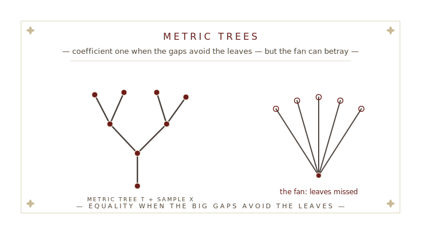

<!--
  BROADSHEET TALK DECK — scaffold

  Structure conventions:
    * Section dividers:  # § N.  Title {.section-divider}
                          + .section-deck (italic one-liner)
                          + .plate (the SVG broadsheet plate)
                          + .plate-caption (italic line under the plate)
    * Content slides:    ## Slide title
                          + .standfirst (opener)
                          + .dispatches (content box; .no-bullets to suppress dots)
                          + .transition-line (closer, with .followup-stamp manicule)
                          + ::: {.notes} (speaker-only)

  Math: KaTeX. ALWAYS use $\nu$, $\rho$, $\Delta$ etc. — NEVER Unicode ν/ρ/Δ
  in body text (CSS text-transform can upcase Greek lowercase letters).

  Palette:  #6c1d1a oxblood (accent)  ·  #2b211a ink (body)
            #57473a sepia (secondary) ·  #c8b894 parchment (rules/fleurons)
-->


# § I.  Section One {.section-divider}

::: {.section-deck}
*Italic one-liner setting up §I.*
:::

::: {.plate}

:::

::: {.plate-caption}
*Short caption under the plate — frames what the plate dramatizes.*
:::

::: {.notes}
Section I speaker notes.
:::


## First content slide

::: {.standfirst style="font-size: 0.95em; margin: -0.3rem 0 0.3rem;"}
The standfirst sets up the slide in one tight sentence — the headline claim.
:::

::: {.dispatches .fragment data-title="Dispatch heading" style="font-size: 0.8em; padding: 0.5rem 1.2rem 0.4rem; margin: 0.5rem auto 0.4rem;"}
- **Bullet one** — body of the first point.
- **Bullet two** — body of the second point.
- **Bullet three** — body of the third point.
:::

::: {.transition-line .fragment .fade-up}
*The line that lands the slide.* [[☞]{.manicule}Next claim]{.followup-stamp .tilt-a}
:::

::: {.notes}
Slide notes — speaker-only context, the why behind the bullets, citations.
:::


# § II.  Section Two {.section-divider}

::: {.section-deck}
*Italic one-liner setting up §II.*
:::

::: {.plate}

:::

::: {.plate-caption}
*Short caption under the plate.*
:::


# § III.  Section Three {.section-divider}

::: {.section-deck}
*Italic one-liner setting up §III.*
:::

::: {.plate}

:::

::: {.plate-caption}
*Short caption under the plate.*
:::


# § IV.  Section Four {.section-divider}

::: {.section-deck}
*Italic one-liner setting up §IV.*
:::

::: {.plate}

:::

::: {.plate-caption}
*Short caption under the plate.*
:::


## Thank you {.colophon}

```{=html}
<div class="finis">F  I  N  I  S</div>
```

::: {.contact}
[paper](https://arxiv.org/abs/0000.00000) · [site](https://example.com) · [email](mailto:author@example.com)
:::

::: {.subscription}
*With thanks to* Collaborator A, Collaborator B. Venue · DD Month YYYY.
:::
